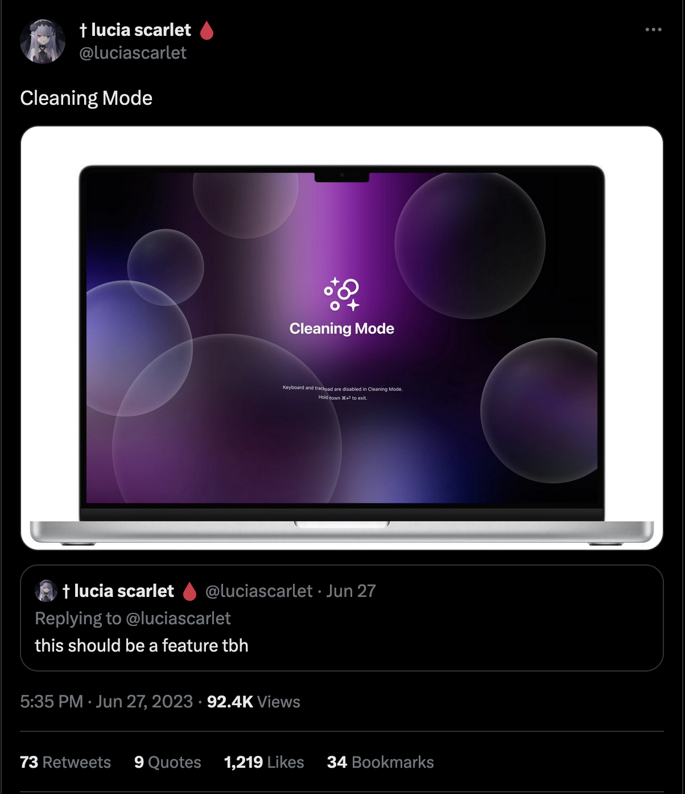

  <picture>
  <source media="(prefers-color-scheme: dark)" srcset="./assets/bubbles.svg">
  
</picture>

# Cleaning Mode

Inspired by [This tweet](https://twitter.com/luciascarlet/status/1673731778991865867) from [@luciascarlet](https://twitter.com/luciascarlet/), I thought I'd put my Rust learnings to use by creating a cleaning mode app for OSX.

Currently a WIP but an official release shouldn't be too far off.

## Todo

-   [x] Complete `Bubble` component
-   [x] Implement close/open from system tray
-   [x] Implement full screen application on cleaning init
-   [] Stop keyboard/mice inputs
-   [x] Close application window on ⌘ + Q press
-   [ ] Better background ???
-   [ ] Build and release V 1.0 ✨

## Incase Twitter dies

### The tweet

### Enhance & zoom

